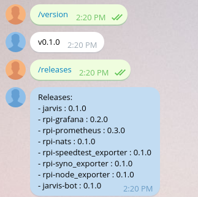

# jarvis-bot

[![License Apache 2][badge-license]](LICENSE)

This [Telegram Bot](https://core.telegram.org/bots/api) could responde you:

* [x] last releases from the Jarvis project (*/releases* command)

Type */help* to show the Bot commands.

[

## Installation

You can download the binaries :

* Architecture i386 [ [linux](https://bintray.com/artifact/download/zeiot/jarvis/jarvis_bot-0.2.0_linux_386) / [darwin](https://bintray.com/artifact/download/zeiot/jarvis/jarvis_bot-0.2.0_darwin_386) / [freebsd](https://bintray.com/artifact/download/zeiot/jarvis/jarvis_bot-0.2.0_freebsd_386) / [netbsd](https://bintray.com/artifact/download/zeiot/jarvis/jarvis_bot-0.2.0_netbsd_386) / [openbsd](https://bintray.com/artifact/download/zeiot/jarvis/jarvis_bot-0.2.0_openbsd_386) / [windows](https://bintray.com/artifact/download/zeiot/jarvis/jarvis_bot-0.2.0_windows_386.exe) ]
* Architecture amd64 [ [linux](https://bintray.com/artifact/download/zeiot/jarvis/jarvis_bot-0.2.0_linux_amd64) / [darwin](https://bintray.com/artifact/download/zeiot/jarvis/jarvis_bot-0.2.0_darwin_amd64) / [freebsd](https://bintray.com/artifact/download/zeiot/jarvis/jarvis_bot-0.2.0_freebsd_amd64) / [netbsd](https://bintray.com/artifact/download/zeiot/jarvis/jarvis_bot-0.2.0_netbsd_amd64) / [openbsd](https://bintray.com/artifact/download/zeiot/jarvis/jarvis_bot-0.2.0_openbsd_amd64) / [windows](https://bintray.com/artifact/download/zeiot/jarvis/jarvis_bot-0.2.0_windows_amd64.exe) ]
* Architecture arm [ [linux](https://bintray.com/artifact/download/zeiot/jarvis/jarvis_bot-0.2.0_linux_arm) / [freebsd](https://bintray.com/artifact/download/zeiot/jarvis/jarvis_bot-0.2.0_freebsd_arm) / [netbsd](https://bintray.com/artifact/download/zeiot/jarvis/jarvis_bot-0.2.0_netbsd_arm) ]

## Usage

Just talk to [BotFather](https://telegram.me/botfather) and follow a few simple steps. Once you've created a bot and received your authorization token, launch the bot.
On your phone, install the [Telegram](https://play.google.com/store/apps/details?id=org.telegram.messenger) application and talk to your bot.

### Executable

    $ jarvis-bot -token xxxxxxxxxxxxxxx

### Docker

    $ docker run -v /etc/kubernetes:/etc/jarvis \
        zeiot/jarvis-bot:0.2.0 \
        -debug -kubeconfig /etc/jarvis/admin.conf -token xxxxxxxxxxxxx

See *--help* command for more options.

## Contributing

See [CONTRIBUTING](CONTRIBUTING.md).

## License

See [LICENSE](LICENSE) for the complete license.

## Changelog

A [changelog](ChangeLog.md) is available

## Contact

Nicolas Lamirault <nicolas.lamirault@gmail.com>

[badge-license]: https://img.shields.io/badge/license-Apache2-green.svg?style=flat
